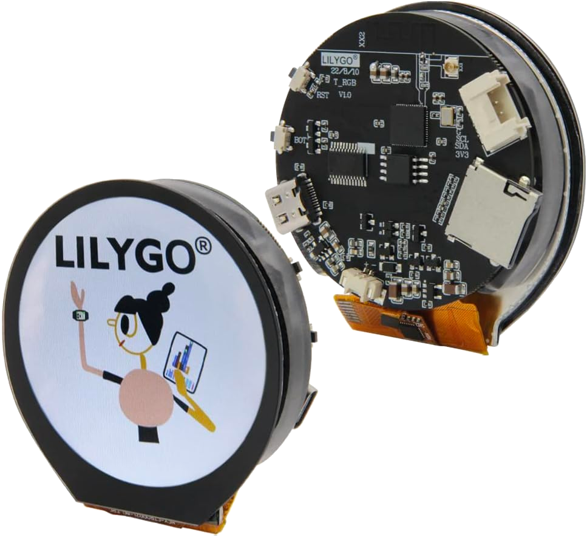

# TRGB Interface Library for Arduino
The [LILYGO TRGB](https://www.amazon.com/dp/B0BKG66T2W) is a compact and convenient ESP32-based microcontroller board with integrated battery management, round OLED display, and I2C interface port.



## Why use this library?
The TRGB does not feature its own ESP32 Arduino board definition or factory supplied library. Instead, you have to rely on the fairly cluttered example sketch or libraries that lack configuration.

To get around this, this library was designed to be configurable and extremely easy to implement.

## Usage
Here is the usage when using the LVGL graphics library and a provided custom boot image. 
- The LVGL interface is extremely easy to generate with tools like [SquareLine Studio](https://squareline.io/).
- The boot logo is also easy to generate using the [LVGL Image Converter](https://lvgl.io/tools/imageconverter).
```C++
#include <Arduino.h>
#include <TRGB.h>
#include "img.h"    //  Boot Image generated by LVGL Image Converter
#include "ui/ui.h"  //  Generated by SquareLine Studio

TRGBModule TRGB;

void setup() {
    TRGB.useDisplay(true);
    TRGB.useDisplayTouch(true);
    TRGB.useLvgl(true);
    TRGB.useBootImage(bootLogo_map);

    TRGB.start();

    ui_init();
}

void loop() {
    lv_timer_handler();
}
```

## Additional Functions
- **Backlight Toggle**
    ```C++
    TRGB.display_backlight(bool state);
    ```
- **ESP32 Deep Sleep** (can disable default touchscreen wakeup behavior with false)
    ```C++
    TRGB.power_deepSleep(bool enableTouchWakeup);
    ```
- **Get battery voltage** returns voltage as a float
    ```C++
    TRGB.power_getVoltage();
    ```
- **Reboot ESP32**
    ```C++
    TRGB.power_restart();
    ```

## Notes
1. LVGL Implementation is simply included for convenience. If you want to use another graphics library, you can disable the default LVGL enable flag. The graphics hardware will still be initialized.
    ```C++
    TRGB.useLvgl(false);
    ```
2. If you do not have or do not want to use a boot image, simply omit the ```TRGB.useBootImage()``` line. The display will remain idle until the graphics library takes over.

## Todo
1. Add native support for other graphics libraries such as Adafruit GFX

## Credits
- [LILYGO TRGB Examples](https://github.com/Xinyuan-LilyGO/T-RGB)
- [fablabnbg TRGBArduinoSupport](https://github.com/fablabnbg/TRGBArduinoSupport)
